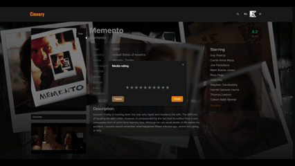

# Cineory

A modern, high-performance movie database website built with Next.js, featuring a sleek design, smooth user experience

## Demo

### Main

### Person page

### Search

### Catalog

### Profile and rating

### User settings

---

## Stack

- **React** + **Next.js (App Router)**
- **TailwindCSS** + **shadcn/ui** - UI
- **React Query** — Endless scrolling
- **Zustand** + **persist** — State manager + local storage
- **React Hook Form** + **Zod** — Forms and validation
- **Firebase** — Authorization and database
- **TMDB API** — Data API
- **Rechartso** — Charts and statistics
- **Internationalization** — next-intl

---

## Opportunities

- Search for movies and TV series
- Catalog with filtering and infinite scrolling
- Profile with folders and user ratings
- Full adaptation for all devices

---

- Contacts: Telegram: https://t.me/afflxn
- This product uses the TMDB API but is not endorsed or certified by TMDB.
